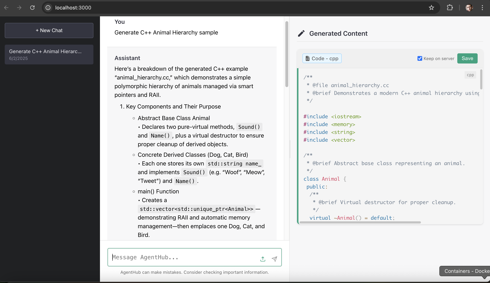

# AgentHub Documentation

Welcome to the AgentHub documentation. This comprehensive set of documents will help you understand and utilize all features of the AgentHub platform.

## Documentation Index

### User Documentation

- [Quick Start Guide](quick_start_guide.md) - Get up and running in minutes
- [Features Overview](features_overview.md) - A high-level overview of AgentHub capabilities
- [Getting Started](getting_started.md) - Quick start guide for new users
- [User Guide](user_guide.md) - Comprehensive documentation of all user features

### Technical Documentation

- [Technical Documentation](technical_documentation.md) - Detailed system architecture and implementation details
- [API Reference](../services/frontend/API.md) - API endpoints and usage
- [Deployment Guide](deployment_guide.md) - Comprehensive guide for setting up and deploying AgentHub
- [Docker Quick Guide](docker-quickguide.md) - Common Docker commands and best practices

## About AgentHub

AgentHub is an advanced AI assistant platform that enables:

1. **Natural Language Conversations** - Interact with AI using natural language
2. **Code and Document Generation** - Create content across multiple formats and languages
3. **Content Updates and Versioning** - Iteratively improve generated content
4. **Multi-Chat Management** - Organize conversations by topic or project

The platform combines a React-based frontend with microservices architecture to provide a seamless and powerful user experience.

## Key Features

- **Multi-Chat Support** - Create, switch between, and manage multiple chat sessions
- **Canvas for Generated Content** - Dedicated space for code and documents with syntax highlighting
- **Content Management** - Copy, save, and expand generated content
- **Update Support** - Request changes to previously generated content with version comparison
- **Rich Explanations** - Detailed context and explanations in the chat interface
- **Visual Feedback** - Clear indicators during content generation
- **File Attachments** - Add context through file uploads

## Screenshots

## Getting Help

If you encounter any issues or have questions not covered in the documentation:

1. Check the [Troubleshooting](user_guide.md#troubleshooting) section in the User Guide
2. Review known issues in the [PROJECT_STATUS.md](../PROJECT_STATUS.md) file
3. Submit an issue through the appropriate channel

---

*Documentation last updated: June 2, 2025*
